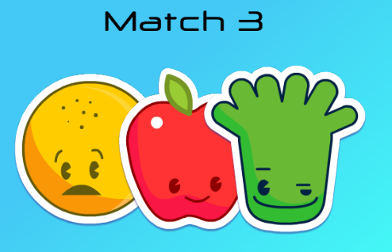

  

### Introduction
A Match-3 game is a block-based puzzle where you move blocks around in the game area to create groups of three or more that share a common attribute (such as a color or a shape). 
Most of the Match-3 games solves the problem of "Unplayable Board State" by shuffling the tiles. It is said that: "Prevention is shall reap better than cure", for that this game implements an "Always have moves" algorithm, which ensures that we will not reach an unplayable state.

### Resources
* Game Assets: https://devilsworkshop.itch.io/match-3-free-2d-sprites-game-art-and-ui
* Game Engine: https://cocos2d-x.org/creator

### Demo
Lightweight version using html5 canvas  
http://hamzajadid.me/match3.html
